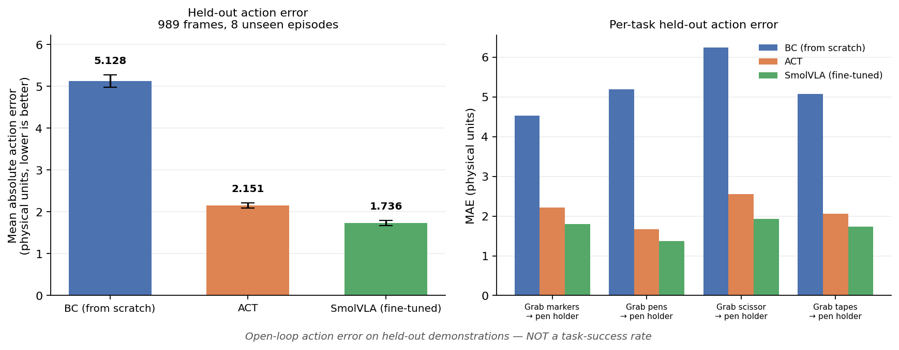
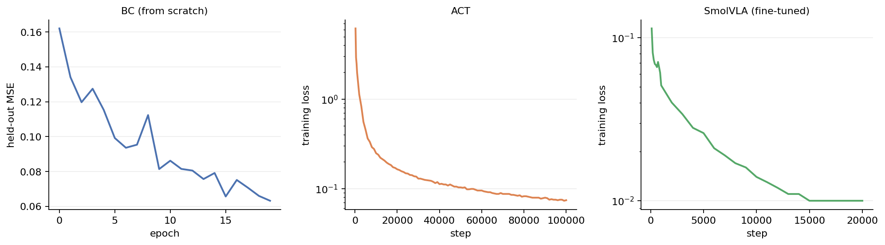
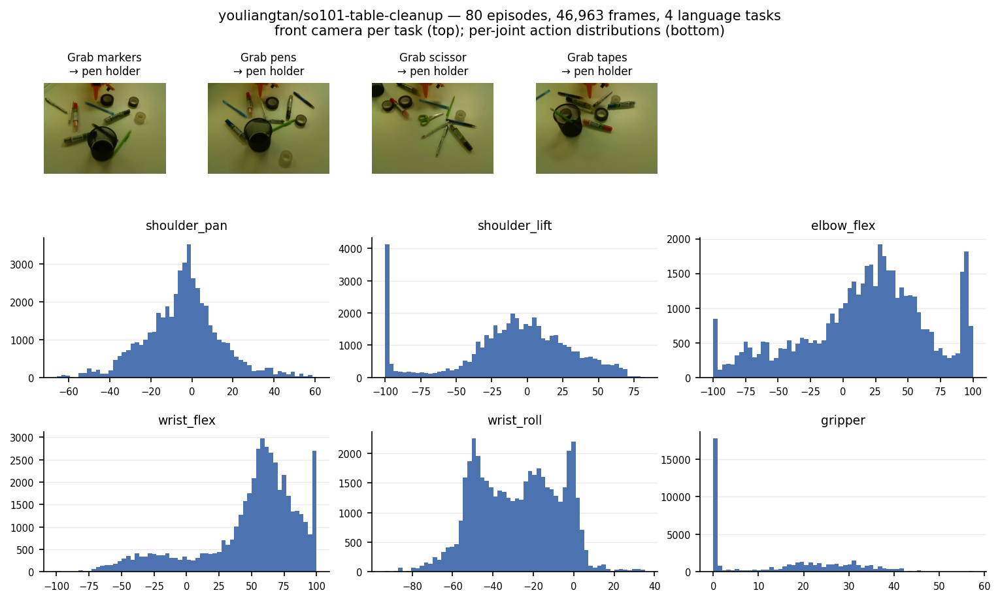
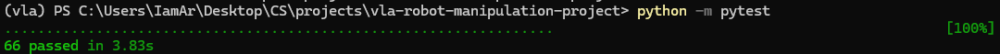
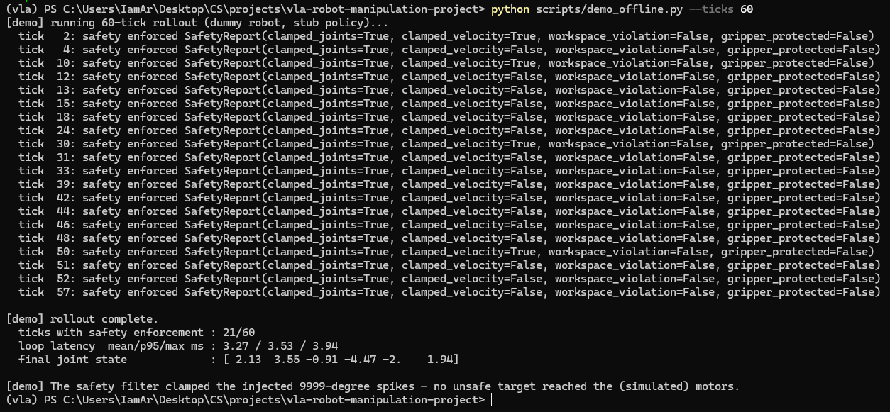

# Language-Conditioned VLA Robot Manipulation

A vision-language-action system for the SO-101 robot arm. It maps a camera image,
a natural-language instruction, and the arm's joint state to continuous joint
commands. The repository covers the full stack: dataset pipeline, a three-model
training ladder, a policy inference server with a safety filter, and an
evaluation harness.

**Scope.** Training and evaluation were performed entirely offline on a public
SO-101 dataset. No physical robot was used. The reported metric is held-out
action-prediction error, not task success rate. The robot-facing code
(teleoperation, calibration, the 30 Hz client, the safety filter) is implemented
and tested against a simulated robot only.

## Results

Three policies were trained on
[`youliangtan/so101-table-cleanup`](https://huggingface.co/datasets/youliangtan/so101-table-cleanup)
(80 episodes, 46,963 frames, 4 language tasks) using an identical 72/8 episode
split, then scored on the same 989 held-out frames.

| Model | Params | Held-out MAE | 95% CI | vs. BC | Inference | Meets 30 Hz |
|-------|--------|--------------|--------|--------|-----------|-------------|
| BC (from scratch) | 12.4M | 5.128 | [4.986, 5.276] | baseline | 14.2 ms | yes, 42.7% duty |
| ACT | 51.6M | 2.151 | [2.090, 2.214] | -58.1% | 45.2 ms | yes, 1.4% duty |
| SmolVLA (fine-tuned) | 450M | **1.736** | [1.673, 1.797] | **-66.1%** | 802 ms | yes, 48.1% duty |



The confidence intervals do not overlap, and the ordering holds on all four
tasks individually. Most of the improvement comes from action chunking and a
temporal architecture (BC to ACT, -58.1%) rather than from the 8.7x parameter
increase to a pretrained VLA (ACT to SmolVLA, a further -19.3%). OpenVLA-7B was
not trained because it does not fit in 12 GB of VRAM.



Full analysis, ablations, and an explicit list of what was not evaluated are in
[`reports/final_report.md`](reports/final_report.md). Model scope and limitations
are in [`reports/model_card.md`](reports/model_card.md).

### Metric definition

Held-out action-prediction error is the mean absolute difference between the
policy's action and the demonstrator's, in physical units (degrees), measured
open-loop on episodes no model trained on. It is a relative ranking of the three
models under identical conditions. It is not a success rate and cannot be
converted into one: the policy is always shown a demonstrator's state, never a
state produced by its own earlier actions, so compounding error is not captured.

### Latency

Measured on an idle RTX 5070, 50 timed calls after warm-up. A deployed loop runs
at 30 Hz, so a query must complete before its action chunk finishes executing.

| Model | Mean | p95 | Chunk | Motion per query | Duty cycle |
|-------|------|-----|-------|------------------|------------|
| BC | 14.2 ms | 14.9 ms | 1 | 33 ms | 42.7% |
| BC, text cache disabled | 33.8 ms | 35.3 ms | 1 | 33 ms | 101.4% |
| ACT | 45.2 ms | 47.0 ms | 100 | 3,333 ms | 1.4% |
| SmolVLA | 802.0 ms | 864.0 ms | 50 | 1,667 ms | 48.1% |

Chunking does not raise the control rate, since the arm runs at a fixed 30 Hz.
It buys time: one query only needs to finish before its chunk runs out. The
second row is an ablation of the frozen CLIP text embedding cache. The
instruction is constant for an entire episode, so re-encoding it every control
tick is wasted work, and removing the cache pushes the baseline past its
real-time budget.

## Data



All four tasks share a single scene, so the instruction is the only signal
distinguishing them. The split is by episode rather than by frame, which
prevents temporally adjacent frames of one demonstration from appearing on both
sides of the boundary.

## Repository layout

```
configs/            Robot geometry, safety envelope, training recipes,
                    paraphrase bank, example evaluation suite
src/vla/
  data/             LeRobotDataset adapter, BC torch Dataset, normalization,
                    train/held-out split, layout randomization, paraphrases
  models/           BC baseline: frozen CLIP text + ResNet-18 image + MLP head
  training/         BC training loop, LeRobot trainer launcher
  inference/        Policy server, robot client, temporal ensembler, safety
                    filter, per-policy wrappers, msgpack wire codec
  eval/             Trial-spec schema, Wilson-CI metrics, operator-in-loop harness
  robot/            SO-101 forward kinematics, LeRobot interface, ROS2 bridge,
                    hardware-free DummyRobot
  utils/            Seeding, YAML config and overrides, checkpoint resolution,
                    experiment logging
scripts/            CLI entrypoints for training, evaluation, benchmarking,
                    figure generation, and robot operation
tests/              66 hardware-free unit and integration tests
notebooks/          dataset_visualization.ipynb
reports/            final_report.md, model_card.md
outputs/            Training logs and evaluation artifacts (weights excluded)
```

## Setup

Requires Python 3.10 and an NVIDIA GPU for training. The offline logic, safety
filter, metrics, and evaluation harness run on CPU.

```bash
conda create -n vla python=3.10 -y && conda activate vla

# Install a CUDA build of torch matched to your GPU first. Blackwell cards
# (RTX 50xx) require cu128; a cu124 build will not run on them.
pip install torch==2.7.0 torchvision==0.22.0 --index-url https://download.pytorch.org/whl/cu128

pip install -r requirements.txt
pip install -e .
```

Verify the install from the repository root:

```bash
python -m pytest                            # 66 passed
python scripts/demo_offline.py --ticks 60
```

Note that `pyproject.toml` already sets `addopts = "-q"`. Passing `-q` again
suppresses the summary line.



### Windows notes

This project was developed and run on Windows 11.

- Enable Developer Mode (Settings, System, For developers). LeRobot marks its
  newest checkpoint with a symlink and the Hugging Face cache deduplicates with
  symlinks. Training works without it, since `vla.training.lerobot_launch` falls
  back to a marker file, but the cache stores duplicate copies of every dataset.
- `torchcodec` has no Windows wheel compatible with torch 2.7, so video decoding
  falls back to pyav. This is the bottleneck for the BC baseline, not the GPU.

## Reproducing the results

Training. One entrypoint, one flag per model. Total runtime was 14 h 14 min on
an RTX 5070.

```bash
python scripts/train.py --policy bc      --config configs/train_bc.yaml
python scripts/train.py --policy act     --config configs/train_act.yaml
python scripts/train.py --policy smolvla --config configs/train_smolvla.yaml
```

Evaluation and figures.

```bash
python scripts/eval_action_error.py \
    --model bc:outputs/bc_baseline_v1/bc_best.pt \
    --model act:outputs/act_v1/checkpoints/100000 \
    --model smolvla:outputs/smolvla_v1/checkpoints/020000 --stride 5

python scripts/bench_latency.py \
    --model bc:outputs/bc_baseline_v1/bc_best.pt \
    --model act:outputs/act_v1/checkpoints/100000 \
    --model smolvla:outputs/smolvla_v1/checkpoints/020000

python scripts/make_figures.py
```

Every figure and number in this README is regenerated from these commands.
Nothing was entered by hand.

## Robot operation

This code path is implemented and unit-tested but has never been run on
hardware. It is included because the system was designed around the client and
server split, not retrofitted to it.

```bash
# On the GPU machine:
python scripts/run_policy_server.py --policy-kind act \
    --checkpoint outputs/act_v1/checkpoints/100000 --port 8000

# On the machine wired to the arm:
python scripts/evaluate.py --suite configs/eval_trials_example.json \
    --server-uri ws://<gpu-host>:8000
```

The harness reports per-condition success with Wilson 95% confidence intervals,
the paraphrase gap, and unseen-position and distractor breakdowns, writing
`trials.csv` and `report.md` per model.

`evaluate.py --dry-run` exercises the harness with no hardware by simulating
outcomes with a seeded Bernoulli draw. Those labels are not measurements. Its
output directory is excluded from version control so it cannot be mistaken for a
result.

## Reproducibility

- Seeds fixed at 42. `set_seed` covers Python, NumPy, torch, and cuDNN.
- Every experiment setting lives in a committed YAML. `--override key=val` layers
  on top without editing the file.
- LeRobot v0.4.1 (PyPI release), pinned in `requirements.txt`.
- The train/held-out split comes from one function (`vla.data.splits`) shared by
  every model and pinned by unit tests. LeRobot's trainer otherwise consumes all
  episodes, including the held-out ones.
- The dataset was converted once from LeRobot codebase format v2.1 to v3.0 with
  `python -m lerobot.datasets.v30.convert_dataset_v21_to_v30`. Its published
  `meta/info.json` overstates the frame count (47,513 against an actual 46,963),
  which makes LeRobot's sampler index past the end of the table until corrected.
- Training logs and evaluation artifacts are committed under `outputs/`. Model
  weights are not.
- Weights and Biases runs: project `vla-manipulation`, linked from
  [`reports/final_report.md`](reports/final_report.md).

## Safety

`SafetyFilter` (`src/vla/inference/safety.py`) sits between the policy and the
motors: per-joint limit clamps, per-tick velocity clamps, a forward-kinematics
workspace bounding box that holds the last safe pose on violation, a gripper
current cap, and a keyboard e-stop that torques off all servos.

`scripts/demo_offline.py` runs the full control loop against a simulated robot
with out-of-range targets injected. Loop latency is 3.27 ms mean, 3.53 ms p95,
3.94 ms max over 60 ticks, with the filter engaging on 21 of those ticks and no
unsafe target reaching the simulated motors.



This is an engineering envelope, not a certified safety controller, and it has
only been tested in simulation.

## License

MIT for this code. Base model weights (SmolVLA, OpenVLA) are under their own
licenses. The dataset is published by its original authors under its own terms.
